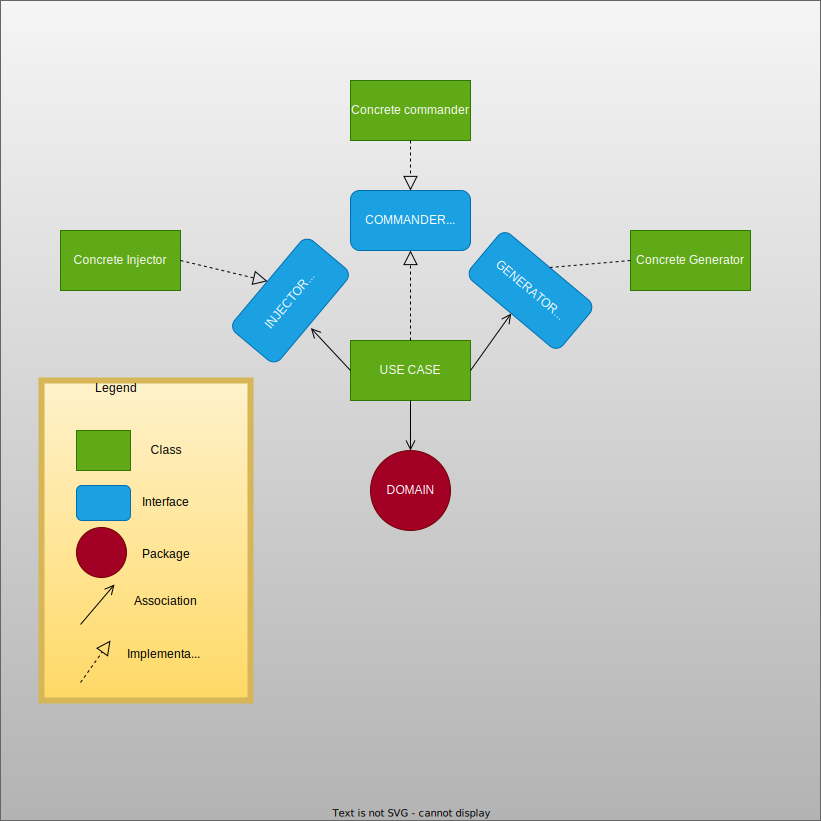

<h1>resume-generator</h1>

  

    <h2>Workflows statuses</h2>
  

  
  
  
  
  
  
  

  <h2>Overview</h2>

  <ol>
    <li>
      

        

          <h3>What is this repository?</h3>
        

        This is a resume generator made using Go.
        

      

    </li>
    <li>
      

        

          <h3>Why this project?</h3>
        

        

          I know there exist a lot of resume generators online made using different strategies, languages, formats,
          colors and so on. However I recently found myself struggling to find a resume generator I could completely
          personalize the way I wanted to, so I decided to build one.
          Also I think Go can be a good tool to use in this case since it has native support for templating (At first I
          was hesitant to use the native libraries because I wanted to use something I had already worked with (Note I'm
          talking about the Mustache templating engine) but I think not having external dependencies is always a good
          idea (I know I use other external dependencies already but still I want to keep the number as minimal as
          possible) ) so I said <i>Why not?</i>
        

        

      

    </li>
    <li>
      

        

          <h3>How can I contribute?</h3>
        

        
If you want to contribute to this project, I would really appreciate that. Remember you don't necessarily
          need to code to contribute, you can test the application in a more professional way that what I do, you can
          add documentation for the usage of the application or even only talking about features that could be important
          in the project is a great way to contribute. I really value contributors so I include them in this README
          file.

        

      

    </li>
    <li>
      

        

          <h3>How's this thing architected?</h3>
        

        

          I do like clean architectures, that's the reason I wanted this project to have a clean architecture, and since
          the purpose of this project is building a resume, I decided to implement an architecture that is based a lot
          on Hexagonal architecture (I like to call it Eneagonal and hopefully that gives you an idea about it) but I
          decided to add another port that acts like the commander (Much like in CQRS) because I wanted to have
          different options to use the software but also I wanted to read the values from an external source (Files
          principally) and generate the full resume using those values but have different options to render that resume
          (Take it to a file, show it in screen, etc). I hope this diagram makes It more clear to you:
        

         
        
        

      

    </li>
  </ol>

<h2>Contributors</h2>
<bold>Special thanks to:</bold>
<h3>Users</h3>
<!-- readme: contributors,collaborators -start -->
<table>
  <tbody>
    <tr>
      <td align="center">
        <a href="https://github.com/nclsbayona">
          
           
          <b>nclsbayona</b>
        </a>
      </td>
      <td align="center">
        <a href="https://github.com/semantic-release-bot">
          
           
          <b>semantic-release-bot</b>
        </a>
      </td>
    </tr>
  <tbody>
</table>
<!-- readme: contributors,collaborators -end -->

<h3>Bots</h3>
<!-- readme: bots -start -->
<table>
  <tbody>
    <tr>
      <td align="center">
        <a href="https://github.com/github-actions[bot]">
          
           
          <b>github-actions[bot]</b>
        </a>
      </td>
      <td align="center">
        <a href="https://github.com/dependabot[bot]">
          
           
          <b>dependabot[bot]</b>
        </a>
      </td>
    </tr>
  <tbody>
</table>
<!-- readme: bots -end -->